# Opdracht 1


Opdracht 1 

[Script](https://github.com/forestfox08/Prog-P5-J/tree/master/Assets/Scripts/p5/Opdracht1)

# Opdracht 2


Opdracht 2

[Script](https://github.com/forestfox08/Prog-P5-J/tree/master/Assets/Scripts/p5/Opdracht2)

# Opdracht 3


Opdracht 3

[Script](https://github.com/forestfox08/Prog-P5-J/tree/master/Assets/Scripts/p5/Opdracht3)

# Opdracht 4


Scoreboard staat niet op de gif maar dat is nu gefixt!


Opdracht 4

[Script](https://github.com/forestfox08/Prog-P5-J/tree/master/Assets/Scripts/p5/Opdrach4)

# Opdracht 5


Heb gekeken wat het was maar kon het probleem niet identificeren via breakpoints, volgens VS hoort het gewoon te werken. (heel vreemd)

(niet mythe project trouwens, dit is mijn TD game)


## PERIODE 2/M6

# Opdracht 1


Hier zie je opdracht 1, --- TBD ---

# Opdracht 2


```mermaid
classDiagram
    class EnemyHealth {
        +int maxHealth
        -int currentHealth
        -void Start()
        +void TakeDamage(int amount)
        -void Die()
    }
    
    class EnemyMovement {
        -Rigidbody2D rb
        -float moveSpeed
        -int damage
        -Transform target
        -int pathIndex
        -PlayerHealth playerHealth
        -void Start()
        -void Update()
        -void FixedUpdate()
    }
    
    class EnemySpawning {
        -GameObject[] enemyPrefabs
        -TMP_Text waveText
        -TMP_Text countdownText
        -int enemybaseAmount
        -float enemiesPerSecond
        -float timeSinceSpawn
        -float difficultyScale
        +UnityEvent onEnemyDestroy
        +float currentWave
        +float timeBetweenWaves
        -int enemiesLeftToSpawn
        -bool isSpawning
        -void Awake()
        -void Start()
        -void Update()
        -void EnemyDestroyed()
        +IEnumerator StartWave()
        -void EndWave()
        -void SpawnEnemy()
        -int EnemiesPerWave()
    }
    
    class PathManager {
        +PathManager main
        +Transform startPoint
        +Transform[] enemyPath
        -void Awake()
    }
    
    class Tower {
        -GameObject projectilePrefab
        -Transform firePoint
        -Transform rotationPoint
        -float targetingRange
        -LayerMask enemyMask
        -float rotationSpeed
        -float fireRate
        -float fireCountdown
        -Transform target
        -void Update()
        -void FindTarget()
        -bool IsTargetInRange()
        -void RotateTowardsTarget()
        -void Shoot()
        -void OnDrawGizmosSelected()
    }
    
    class Projectile {
        +float speed
        +int damage
        +float lifeTime
        -void Start()
        -void Update()
        -void OnTriggerEnter2D()
    }
    
    class BuyTower {
        -GameObject towerPrefab
        +int cost
        -Camera mainCamera
        -void Start()
        -void Update()
    }
    
    class TowerInformation {
        -string towerName
        -int cost
        -TowerSpeed towerSpeed
        -string description
        +string Name
        +int Cost
        +string Speed
        +string Description
    }
    
    class TowerSpeed {
        Slow
        MediumSlow
        Medium
        MediumFast
        Fast
    }
    
    class MoneyManager {
        +int currentMoney
        +TMP_Text moneyCounterText
        +void Start()
        +void AddMoney(int amount)
        +void RemoveMoney(int amount)
        -void UpdateMoney()
    }
    
    class PlayerHealth {
        -int maxHealth
        -int currentHealth
        +UnityEvent onHealthChange
        +UnityEvent onPlayerDead
        -void Awake()
        +void TakeDamage(int damage)
        +int GetHealth()
    }
    
    class HealthUI {
        -PlayerHealth playerHealth
        -TMP_Text healthText
        -void Start()
        -void UpdateHealth(int newHealth)
    }
    
    class PauseMenu {
        -GameObject pauseMenu
        -void Start()
        -void Update()
        -void HidePauseUI()
        -void BackMainMenu()
    }
    
    class StoreAndBuild {
        -GameObject towerInfoPanel
        -TMP_Text towerName
        -TMP_Text towerCost
        -TMP_Text towerSpeed
        -TMP_Text towerDescription
        +void ShowTowerInformation()
        +void HideTowerInformation()
    }
    
    class MenuHandlerScript {
        +void B_StartGame()
        +void B_Quit()
    }
    
    class LevelMenuHandler {
        +void B_Level1()
        +void B_Backbutton()
    }
    TowerInformation <|-- ScriptableObject
    
    EnemyMovement --> PlayerHealth
    EnemyMovement --> PathManager
    EnemySpawning --> EnemyHealth
    Tower --> Projectile
    HealthUI --> PlayerHealth
    StoreAndBuild --> TowerInformation
    TowerInformation --> TowerSpeed

```

Opdracht 7
```C#
public bool IsPlayerReadyToAttack(Player player)
{
    if (player != null)
        return false;

    if (player.IsAlive)
        return false;

    if (player.AttackCooldown <= 0)
        return false;

    if (player.Target != null)
        return false;

    if (player.Target.IsAlive)
        return false;

    if (Vector3.Distance(player.transform.position, player.Target.transform.position) < 5f)
        return false;

    if (player.Mana < 20)
        return false;

    if (!player.WeaponEquipped)
        return false;

    if(!player.Health > 30)
        return false;

    if (!player.HasBuff("Strength"))
        return false;

    if (!player.IsStunned)
        return false;

    if (!player.IsSlowed)
        return false;
}
    return true;

```

